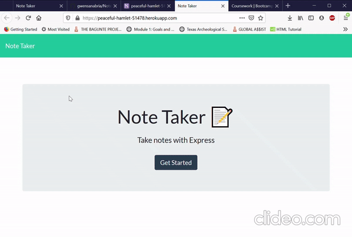

# Note Taker

Allows user to input, view, and delete notes.

## Installation

Click on attached link.

## Usage

Input title and description to be able to save note. Click on note itself on left hand side to view that specific note. Click on trash icon to delete note. When viewing a note, click the pencil icon to input a new note.

## Contributing
Feel free to fork repo. For major changes, please open an issue first to discuss what you would like to change.

## License

